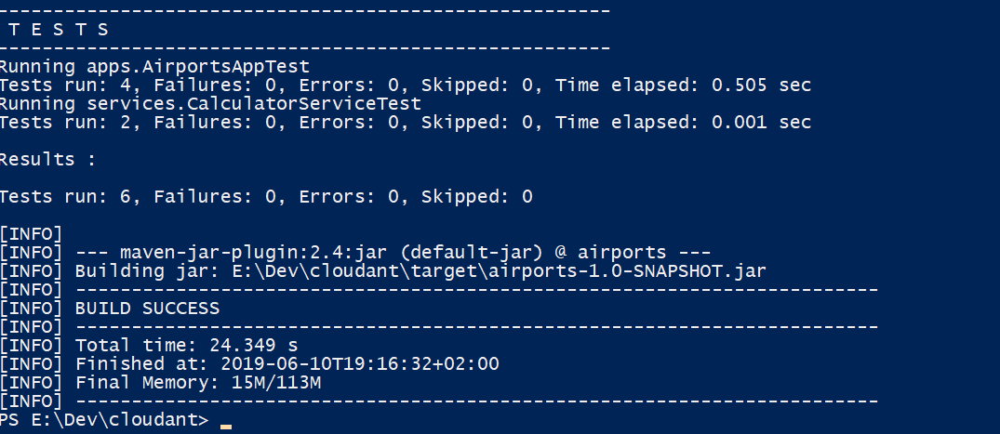
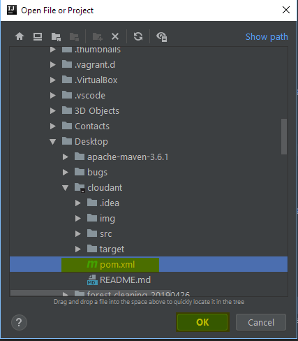
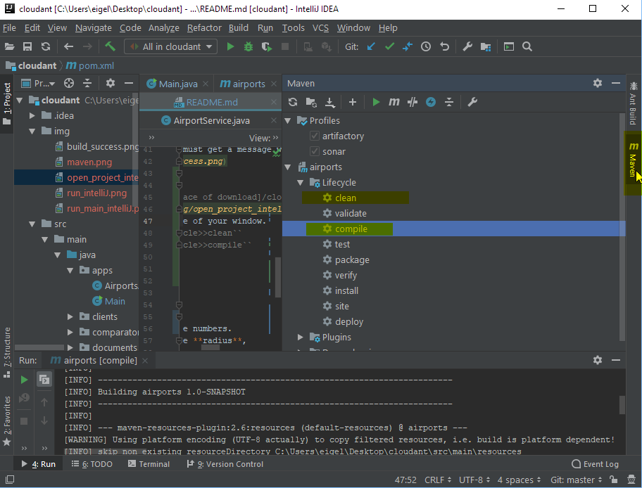
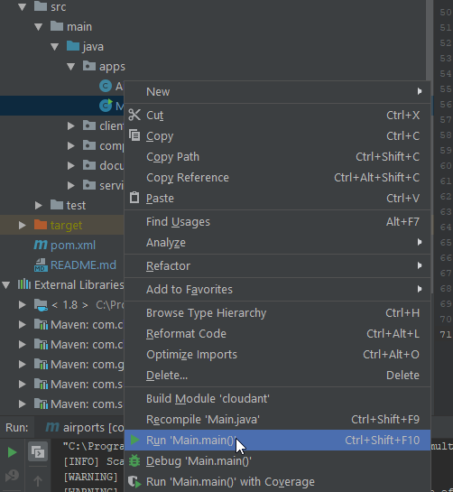
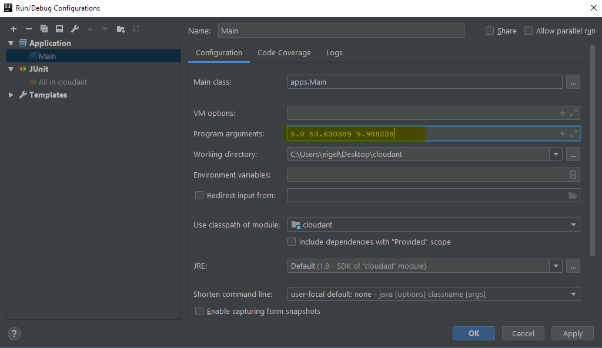

# World of Airports

In short, this application is using pulls data about airports from a Cloudant database and
displays their location in a simple list, sorted by distance.

## Requirements

#### **Java JDK 1.8.0<=**
1. Check actual version with the following command: `java -version`. If it is not installed:
    * [Link to download](https://www.oracle.com/technetwork/java/javase/downloads/jdk8-downloads-2133151.html)
    * [Installation guide](https://docs.oracle.com/javase/8/docs/technotes/guides/install/install_overview.html)
2. Check environmental variables are set properly with command :
    * [Set](https://docs.oracle.com/cd/E19182-01/820-7851/inst_cli_jdk_javahome_t/) `JAVA_HOME` variable.
    * [Set](https://www.java.com/en/download/help/path.xml) `Path` variable for the installed jdk bin folder.

#### **Apache Maven 3.3.9<=**

1. [Link to download](https://maven.apache.org/download.cgi)
2. [Installation guide](https://maven.apache.org/install.html)

## Build
This part describes how to download, build and start AirportsApp

### Download this git repo

You can clone/download directly this repository
1. If you have git bash, you can clone with the following command:
``~$ git clone https://github.com/mojito317/cloudant.git``
2. If not, you can download the zipped project directly from
[this link](https://github.com/mojito317/cloudant/archive/master.zip). You have to unzip it before further steps.

### Build AirportsApp

#### From CLI
1. Open command prompt/terminal and change folder to where you downloaded the program:
``cd [place of download]/cloudant``
2. Clean, install and build the program with the help of maven:
``mvn clean dependency:copy-dependencies install package``
    * If everything went well you must get a message with `BUILD SUCCESS` in it, something like this:
    
#### From IntelliJ
1. Open project from IntelliJ:
  ``File >> Open >> Search for [place of download]/cloudant/pom.xml >> OK``
  
2. Click on Maven on the right side of your window.
    3. Click on ``airports>>Lifecycle>>clean`` 
    4. Click on ``airports>>Lifecycle>>compile`` 
    

## Run
### From CLI
1. Run Main class with three double numbers.
  * The first number represents the **radius**,
  * the second the **latitude**
  * the third the **longitude**
  * E. g. when we want 5 degree radius, from 53.630389 degree latitude and 9.988228 degree longitude we should type the following:
    ``java -cp target/classes apps.Main 5.0 53.630389 9.988228``
### From IntelliJ
1. Right click on the Main class (left side of your window)
    1. Run Main.main()
    
2. Click on ``Run>>Edit configurations`` and set the arguments of the main application in field ``Program arguments`` to three double numbers:
  * The first number represents the **radius**,
  * the second the **latitude**
  * the third the **longitude**
  * E. g. when we want 5 degree radius, from 53.630389 degree latitude and 9.988228 degree longitude we should type the following:
    ``5.0 53.630389 9.988228``
    
3. Repeat the first step